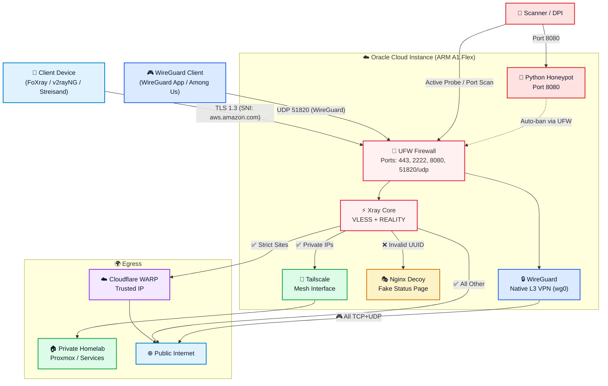

# 🛡️ Sovereign OCI Proxy

     

**Sovereign OCI Proxy** is a field-tested, production-grade architecture for building an anti-censorship proxy fortress using the Oracle Cloud Always Free Tier.

Built with a triple purpose:
1. **Freedom of communication** — Bypass government Deep Packet Inspection (DPI) in hostile networks (Egypt, China, Iran, corporate firewalls) by disguising traffic as normal HTTPS to commercial servers.
2. **Secure Homelab access** — Route decrypted traffic into a Tailscale mesh network, acting as an external shield without ever exposing ports on your home router.
3. **Gaming & Full VPN** — Native WireGuard tunnel for apps that can't use a proxy (Among Us, WhatsApp calls, VoIP, any UDP-based application).

---

## 🏗️ Architecture



### How It Works

| Step | What Happens |
| --- | --- |
| **1. Entry** | Your device connects to port 443. To any observer, it looks like encrypted HTTPS to `aws.amazon.com`. |
| **2. Authentication** | Xray validates the UUID and cryptographic short-ID. Invalid connections are silently forwarded to a fake "Cloud Monitor" page. |
| **3. Honeypot** | Port scanners hitting 8080 are caught, logged, and permanently banned by UFW. |
| **4. Routing** | Valid traffic is routed based on destination: private IPs → Tailscale → Homelab, strict sites → Cloudflare WARP (hides datacenter IP), everything else → direct internet. |
| **5. Gaming** | The WireGuard tunnel (UDP 51820) provides a native Layer 3 VPN for apps that can't use a proxy: Among Us, WhatsApp calls, VoIP, and any UDP-based app. |

---

## 🎮 Gaming & Full VPN Mode (WireGuard)

The VLESS proxy is invisible to DPI but only works with apps that support proxy configuration. Games like **Among Us** use raw UDP sockets and cannot use a proxy.

The WireGuard module solves this by adding a native Layer 3 VPN tunnel alongside the existing proxy:

```bash
# Install WireGuard on the server (generates QR code for your phone)
sudo ./scripts/modules/wireguard.sh

# Manage clients
sovereign-wg-client.sh add laptop     # Add a new device
sovereign-wg-client.sh qr phone       # Show QR code for phone
sovereign-wg-client.sh list           # List all connected devices
```

**On your phone/laptop:** Install the free [WireGuard app](https://www.wireguard.com/install/), scan the QR code, and connect. All traffic (TCP + UDP) flows through your server.

> ⚠️ **Oracle Cloud Security List:** You must add an Ingress Rule for **UDP port 51820** in your VCN Security List.

### Anti-DPI Obfuscation (Optional)

If your ISP blocks WireGuard traffic (common in Egypt, China, Iran):

```bash
sudo ./scripts/modules/wg-obfs.sh
```

This wraps WireGuard inside WebSocket (wstunnel) or fake TCP headers (udp2raw) to bypass DPI.

---

## ⚠️ Critical: The Port 22 Lockout

> **If you change SSH to port 2222 without opening it in Oracle Security Lists first, you will be permanently locked out.**

The correct sequence:
1. Add port **2222** to Oracle Security List (**keep** port 22)
2. Edit `/etc/ssh/sshd_config` → `Port 2222`
3. Restart SSH
4. Test with a **second terminal** on port 2222
5. Only then delete port 22 from Security List

---

## 🚀 Quick Start

```bash
# On the Oracle instance:
git clone https://github.com/Mohamed-DN/sovereign-oci-proxy.git
cd sovereign-oci-proxy

# Create and edit the configuration file!
cp config.env.example config.env
nano config.env # <--- Fill in your DuckDNS token and Ntfy URL here

# Run the installer
sudo chmod +x scripts/**/*.sh scripts/*.sh tests/*.sh
sudo ./scripts/install.sh
```

📖 Full step-by-step guide: [docs/QUICKSTART.md](docs/QUICKSTART.md)

---

## 🆘 Disaster Recovery (30 Minutes)

This architecture survives server death:
- **Nightly backups** encrypt the database with **asymmetric GPG** (AES-256, public key only)
- Encrypted archives are uploaded to **Backblaze B2**
- The **private key never touches the server** — even if compromised, backups are unreadable
- **Recovery:** New instance → clone repo → install → restore decrypted DB → done

---

## 🧪 Validation

Run the 23-point test suite on a live server:

```bash
sudo ./tests/sovereign-test.sh
```

Target: **23/23** ✅

---

## 🛣️ Roadmap

### v1.0 — Proxy Core ✅
- VLESS + REALITY + XTLS-Vision proxy
- Multi-layer defense (UFW, Fail2ban, Honeypot, Auditd)
- Cloudflare WARP integration
- Tailscale mesh for Homelab access
- GPG asymmetric backups to B2

### v1.1 — Gaming & Full VPN ✅
- Native WireGuard tunnel (Layer 3, UDP support)
- Client management CLI (`sovereign-wg-client.sh`)
- QR code generation for mobile devices
- Split tunnel configuration
- Anti-DPI obfuscation (wstunnel / udp2raw)
- WireGuard health monitoring with Ntfy alerts

### v2.0 — Stealth & Enterprise IaC ✅
- **Terraform:** Automatic Oracle instance provisioning, VCN, and Security Lists
- **Telegram C2 Bot:** Remote management without SSH (`sovereign-telebot.py`)
- **Port 443 Multiplexing:** WireGuard moved to UDP 443 for ultimate DPI stealth
- **WARP Chaining:** Route WireGuard native clients through Cloudflare WARP via Policy Routing
- **Ad-blocking DNS:** Local `dnsmasq` blocking ads and malware for VPN clients

### v3.0 — Beta (Containerization)
- **Ansible:** Fully idempotent OS hardening
- **Docker:** Containerized deployment option

---

## 📁 Project Structure

```
sovereign-oci-proxy/
├── README.md                    # You are here
├── LICENSE                      # AGPL-3.0
├── CONTRIBUTING.md              # How to contribute
├── SECURITY.md                  # Security policy
├── CHANGELOG.md                 # Version history
├── terraform/                   # Infrastructure as Code
│   ├── main.tf                  # OCI VCN and Compute provisioning
│   ├── variables.tf             # Terraform variables
│   └── outputs.tf               # Terraform outputs
├── docs/
│   ├── ARCHITECTURE.md          # Detailed architecture & diagrams
│   ├── QUICKSTART.md            # Zero-to-hero setup guide
│   ├── FULL_GUIDE.md            # Complete operations manual (S.O.A.P.)
│   ├── TROUBLESHOOTING.md       # Common issues & fixes
│   └── FAQ.md                   # Frequently asked questions
├── scripts/
│   ├── install.sh               # Master installer
│   ├── uninstall.sh             # Clean uninstaller
│   ├── sovereign-setup          # Interactive TUI menu
│   └── modules/
│       ├── hardening.sh         # OS hardening (Swap, BBR, SSH, UFW)
│       ├── decoy.sh             # Nginx decoy site setup
│       ├── duckdns.sh           # DuckDNS auto-updater
│       ├── xray.sh              # 3x-ui installation
│       ├── xray-routing-fix.py  # Fix: Enable Tailscale private IPs
│       ├── xray-client-fix.py   # Fix: 3x-ui v3.6.0 client injection
│       ├── monitoring.sh        # Honeypot + Anti-idle + WG health
│       ├── backup.sh            # GPG encryption + B2 upload
│       ├── wireguard.sh         # WireGuard VPN install (UDP 443)
│       ├── split-tunnel.sh      # Split tunnel configuration
│       ├── wg-obfs.sh           # WireGuard anti-DPI obfuscation
│       ├── warp-chain.sh        # WG to Cloudflare WARP chaining
│       ├── telegram-bot.sh      # Telegram C2 management bot
│       └── dns-blocker.sh       # dnsmasq Ad/Malware blocker
├── configs/
│   ├── nginx/decoy.conf         # Full Nginx configuration
│   ├── sysctl/sovereign.conf    # BBR + TCP tuning + security
│   ├── systemd/                 # Service and timer units
│   ├── xray/config.json.template # Xray routing template
│   └── wireguard/               # WireGuard config templates
│       ├── wg0.conf.template    # Server configuration template
│       └── client.conf.template # Client configuration template
├── tests/
│   ├── sovereign-test.sh        # 30-point validation suite
│   ├── test-health-check.sh     # Health check simulation
│   └── test-backup.sh           # Backup pipeline test
├── docker/                      # Docker support (experimental)
└── .github/
    ├── workflows/ci.yml         # Automated linting & secret scanning
    └── workflows/release.yml    # Auto-release on tags
```

---

## 📄 License

This project is licensed under the [GNU Affero General Public License v3.0](LICENSE).

