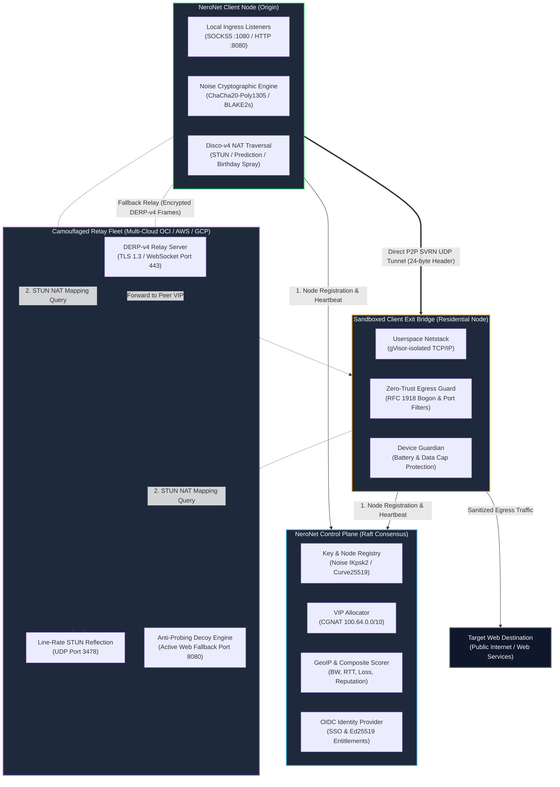
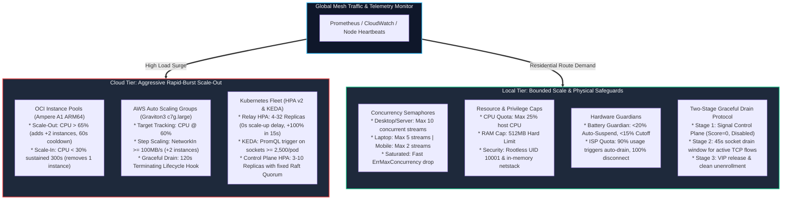
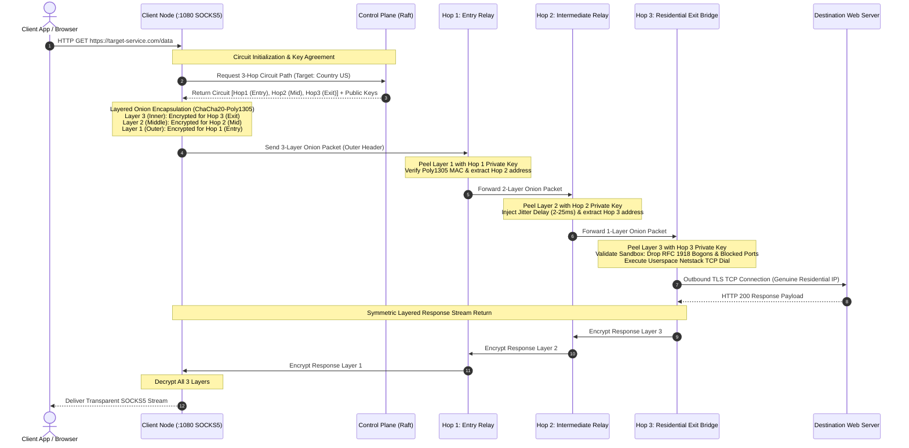

<div align="center">

# 🌐 NeroNet v4.0 (DarkNero Mesh)
### Sovereign Overlay Mesh, Camouflaged Relays & Residential Proxy Routing

[](LICENSE)
[](https://goreportcard.com/report/github.com/sovereign/proxy/v4)
[]()
[-success.svg)]()
[]()
[]()
[]()

**NeroNet v4.0 (DarkNero Mesh)** is an enterprise-grade, decentralized zero-trust overlay mesh, camouflaged packet relay fleet, and residential egress proxy system deployed on `DARKNERO.COM` (`neronet.darknero.com`).

[Key Features](#-key-features) • [Architecture Graphics](#-architecture-diagrams) • [5-Minute Quickstart](#-5-minute-quickstart) • [CLI Reference](#-operator-cli-reference) • [Multi-Cloud & K8s](#-multi-cloud--kubernetes-deployment) • [Auto-Scaling](#-dual-tier-auto-scaling) • [Documentation & Roadmap](#-documentation-index) • [Contributing](CONTRIBUTING.md)

</div>

---

## 🚀 Overview

NeroNet v4.0 provides impenetrable cryptographic network privacy, censorship evasion, line-rate packet relaying, and residential egress routing. It operates across heterogeneous cloud infrastructure (OCI Always-Free ARM64, AWS Graviton, GCP Tau, DigitalOcean, Hetzner, Vultr) and decentralized user-contributed edge devices.

```
+---------------------------------------------------------------------------------------------------+
|                              NERONET v4.0 SOVEREIGN MESH ECOSYSTEM                                |
+---------------------------------------------------------------------------------------------------+
|                                                                                                   |
|  [ Client Ingress ]        [ Camouflaged Relay Fleet ]        [ Decentralized Exit Bridges ]      |
|  * SOCKS5 (Port 1080)      * TLS 1.3 / WSS on Port 443        * Userspace gVisor Netstack         |
|  * HTTP CONNECT (8080)     * Line-Rate STUN (3478 UDP)        * Strict RFC 1918 Bogon Drops       |
|  * Noise IKpsk2 Handshake  * Active Decoy Web Engine (8080)   * Dynamic Country & Host Selection  |
|  * 3-Hop Onion Encaps      * eBPF / IPSet Threat Defense      * Battery & Data Cap Guardians      |
|                                                                                                   |
+---------------------------------------------------------------------------------------------------+
```

---

## ✨ Key Features

| Capability | Description |
|---|---|
| 🔐 **Noise Cryptographic Plane** | Zero-trust authentication via `Noise_IKpsk2_25519_ChaChaPoly_BLAKE2s` with ephemeral session rekeying and anti-replay protection. |
| ⚡ **SVRN Binary Wire Framing** | High-throughput 24-byte binary wire framing (`0x5356524E`) delivering line-rate direct UDP transport. |
| 🛡️ **Camouflaged DERP-v4 Relays** | Cloud-neutral WebSocket relays operating on HTTPS port 443 with TLS fingerprint mimicry and anti-probing decoy web servers. |
| 🎯 **Adaptive Disco-v4 NAT** | Multi-strategy NAT hole puncher combining STUN reflection, sequential port prediction, and 256-port birthday spraying. |
| 🌐 **Multi-Mode Routing Engine** | Granular routing supporting **ISO Country Selection** with composite health scoring, **Host ID Direct Anchoring**, and **3-Hop Layered Onion Obfuscation**. |
| 🔒 **Sandboxed Userspace Bridge** | gVisor userspace netstack isolation, strict RFC 1918/Bogon egress rejection, and anti-abuse port blocking (SMTP/NetBIOS/SMB). |
| 📈 **Dual-Tier Auto-Scaling** | Aggressive rapid-burst scaling for cloud relays (OCI Instance Pools, AWS ASGs, K8s HPA/KEDA) paired with bounded physical governance for local edge nodes. |
| ☁️ **Sovereign App Bundles** | 1-Click OIDC Single Sign-On and dynamic container provisioning for **Nextcloud**, **Immich AI Photo Vault**, and **Seafile**. |
| 🪤 **Active Defense Honeypot** | Real-time threat scoring engine with automated IP banning across `ipset`, `nftables`, and `ufw`. |

---

## 📊 Architecture Diagrams

### 1. P2P Mesh & Control Plane Architecture



---

### 2. Dual-Tier Auto-Scaling Architecture



---

### 3. Client Exit Routing & 3-Hop Onion Obfuscation Flow



---

## ⚡ 5-Minute Quickstart

Get a complete local Sovereign Mesh cluster running in under 5 minutes with zero cloud dependencies.

### Step 1: Clone & Configure

```bash
git clone https://github.com/Mohamed-DN/sovereign-oci-proxy.git
cd sovereign-oci-proxy

# Copy master environment template
cp .env.example .env
chmod 600 .env
```

### Step 2: Build Binaries

```bash
make build
```

Compiled binaries are located in `./bin/`:
- `bin/sovereign-control-plane`
- `bin/sovereign-relay`
- `bin/sovereign-node`
- `bin/sovereign-cli`

### Step 3: Launch Local Daemons

```bash
# 1. Start Control Plane Coordinator
./bin/sovereign-control-plane --listen-addr 127.0.0.1:8443 &

# 2. Start Camouflaged Relay Node
./bin/sovereign-relay --listen-addr 127.0.0.1:8444 --stun-addr 127.0.0.1:3478 --region local-dev &

# 3. Start Client Node Ingress
./bin/sovereign-node --socks-addr 127.0.0.1:1080 --http-addr 127.0.0.1:8080 --control-url http://127.0.0.1:8443 &
```

### Step 4: Verify Proxy Routing

```bash
# Route request through local SOCKS5 proxy
curl -x socks5h://127.0.0.1:1080 https://cloudflare.com/cdn-cgi/trace
```

---

## 🐳 Docker Compose Deployment

To run a multi-container local mesh cluster with isolated honeypot and threat watchers:

```bash
docker compose -f configs/docker-compose.cluster.yml up -d
docker compose -f configs/docker-compose.cluster.yml ps
```

---

## 💻 Operator CLI Reference

The `sovereign-cli` utility provides cluster administration, cryptographic key generation, circuit debugging, and NAT diagnostics:

| Command | Usage | Description |
|---|---|---|
| `status` | `sovereign-cli status` | Displays control plane status, active relays, and mesh VIP CIDR. |
| `peers` | `sovereign-cli peers [COUNTRY]` | Discovers active exit bridges filtered by ISO country code with composite scores. |
| `circuit` | `sovereign-cli circuit [COUNTRY]` | Builds and inspects a 3-Hop Layered Onion Circuit path. |
| `keygen` | `sovereign-cli keygen` | Generates a fresh Curve25519 identity keypair and Node ID. |
| `stun-ping` | `sovereign-cli stun-ping <host:port>` | Probes a STUN reflector endpoint and measures NAT mapping round-trip latency. |

---

## ☁️ Multi-Cloud & Kubernetes Deployment

### Terraform / OpenTofu Infrastructure as Code

Sovereign Mesh includes production modules for 6 major cloud providers under `terraform/modules/`:

```bash
cd terraform/environments/prod-multi-cloud
terraform init
terraform apply -var-file="terraform.tfvars"
```

- **Oracle Cloud (OCI)**: Always-Free Ampere A1 ARM64 (4 OCPUs, 24 GB RAM) with automated Instance Pool autoscaling.
- **Amazon Web Services (AWS)**: Graviton3 (`c7g.large`) with Auto Scaling Groups and Terminating Lifecycle Hooks.
- **Google Cloud Platform (GCP)**: Tau T2A Compute Engine instances.
- **DigitalOcean, Hetzner & Vultr**: Cost-effective cloud edge relays.

### Kubernetes Helm Chart

Deploy the high-availability mesh cluster to any standard Kubernetes distribution (EKS, OKE, GKE, K3s):

```bash
# Lint and validate chart
helm lint charts/sovereign-mesh/

# Deploy Sovereign Mesh
helm upgrade --install sovereign-mesh charts/sovereign-mesh/ \
  --namespace sovereign-mesh \
  --create-namespace \
  -f charts/sovereign-mesh/values.yaml
```

---

## 📈 Dual-Tier Auto-Scaling

| Dimension | Cloud Relay Fleet (OCI / AWS / K8s) | Local Residential Nodes |
|---|---|---|
| **Elasticity Strategy** | Aggressive Scale-Out & Rapid Burst | Bounded Scale & Physical Safeguards |
| **Trigger Metrics** | CPU $> 65\%$, NetworkIn $\ge 100\text{ MB/s}$, Sockets $\ge 2500$ | Concurrency Semaphores (Max 10 streams) |
| **Scale-Up Speed** | Instant (0s stabilization, +100% capacity in 15s) | Limited by hardware concurrency cap |
| **Scale-Down Policy** | 300s stabilization window, 120s socket drain | Two-Stage Graceful Drain (45s window) |
| **Physical Protections**| Multi-AZ distribution, instance redundancy | Battery Guardian ($<20\%$ suspend, $<15\%$ exit), 90% Data Cap auto-drain |

*(For full engineering specifications, see [`docs/AUTOSCALING.md`](docs/AUTOSCALING.md))*

---

## 📦 Sovereign Private Cloud & Add-on Bundles

NeroNet integrates 1-click sovereign private cloud applications with automated OIDC Single Sign-On and per-user container orchestration:

- 📁 **Nextcloud Suite**: File sync, Collabora Online document editing, calendar & contacts.
- 📸 **Immich AI Photo Vault**: Mobile auto-backup, vector facial recognition & object search.
- ⚡ **Seafile Enterprise**: High-throughput file sync with C-core block deduplication.

*(For SSO identity federation, per-tenant LUKS2 encryption, and scale-to-zero inactivity architecture, see [`BUSINESS_AND_ROADMAP.md`](BUSINESS_AND_ROADMAP.md))*

---

## 📚 Documentation Index

- 📖 **[Developer Onboarding & Setup Guide](DEVELOPER_SETUP.md)**: End-to-end local & multi-cloud deployment instructions.
- 📈 **[Auto-Scaling Architecture Specification](docs/AUTOSCALING.md)**: Cloud Instance Pools, ASGs, and Kubernetes HPA/KEDA.
- 💼 **[Business Plan & App Bundles Architecture](BUSINESS_AND_ROADMAP.md)**: Nextcloud, Immich, Seafile SSO & Monetization roadmap.
- 🔮 **[NeroNet v5.0 Next-Generation Roadmap](FUTURE_PLANS.md)**: Post-quantum ML-KEM-768, eBPF/XDP line-rate relays, and native mobile apps.
- ⚙️ **[Environment Configuration Template](.env.example)**: Comprehensive configuration matrix and reference guide.
- 🧪 **[Test Infrastructure & E2E Verification](TEST_INFRA.md)**: 5-Tier test methodology covering 330+ test cases.

---

## 🛡️ Security, Privacy & Audit

- **Zero Hardcoded Secrets**: Fully audited configuration model with environment isolation.
- **Rootless Container Execution**: All services run strictly under unprivileged UID `10001:10001` with `read_only: true` root filesystems.
- **Zero-Trust Egress**: Userspace socket netstack enforces strict RFC 1918/Bogon filtering and anti-abuse port blocking.
- **Continuous Defense**: Dynamic honeypots monitor port scans and trigger automated firewall quarantines.

---

## ⚖️ License & Governance

NeroNet v4.0 is released under the open-source **AGPL-3.0 License**. Maintained by the NeroNet Admin Group.
