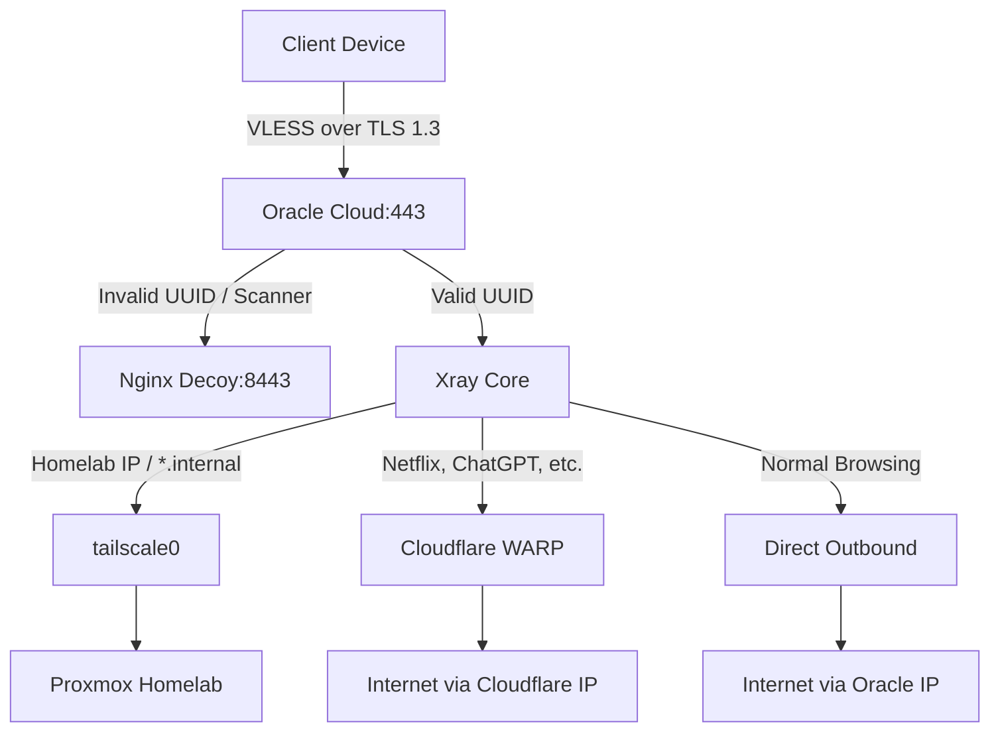

# 🏗️ Architecture Design

## Core Components
- **VPS Provider:** Oracle Cloud Infrastructure (OCI) - ARM A1.Flex (2 OCPU, 12GB RAM)
- **OS:** Ubuntu 24.04 Minimal
- **Ingress Protocol:** VLESS + REALITY + XTLS-Vision (Port 443)
- **Proxy Core:** Xray-core (managed via 3x-ui)
- **Decoy:** Nginx serving a fake "Cloud Infrastructure Monitor" status page
- **Mesh Network:** Tailscale (Routing to private Homelab)
- **Security:** UFW, Fail2ban, Auditd, Python Honeypot
- **Backup:** Asymmetric GPG encryption to Backblaze B2

## Traffic Flow Diagram

