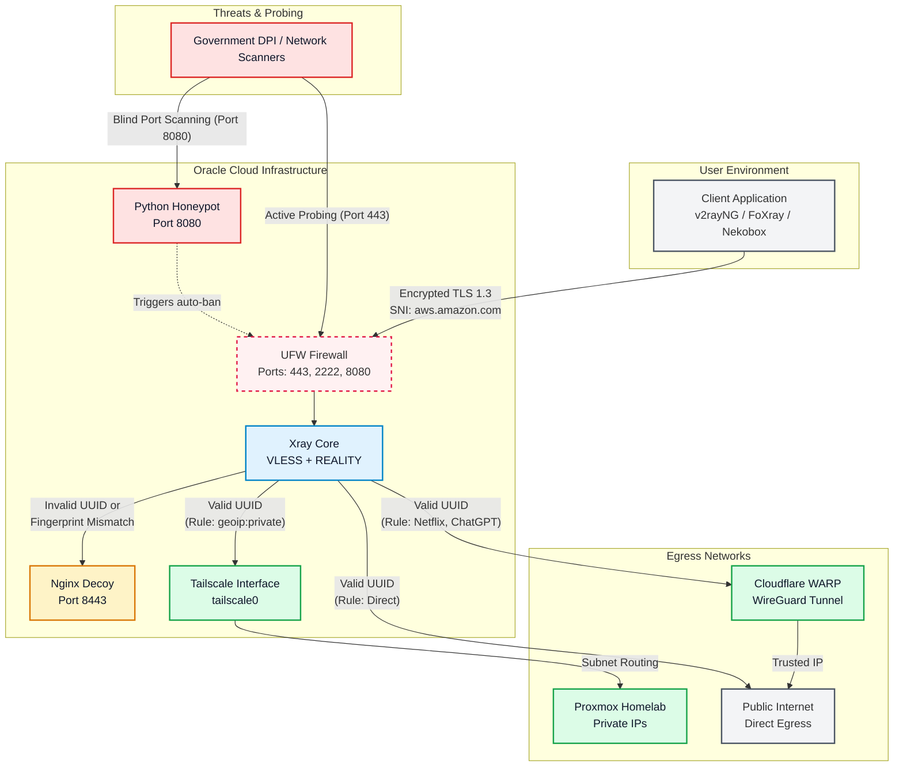

# 🏗️ Architecture Design & Traffic Flow

The Sovereign Proxy utilizes a highly compartmentalized architecture. It is designed to disguise traffic from advanced Deep Packet Inspection (DPI) while seamlessly bridging the user to both the public internet and a private Homelab.

## Core Components
*   **VPS Provider:** Oracle Cloud Infrastructure (OCI) - ARM A1.Flex
*   **Ingress Protocol:** VLESS + REALITY + XTLS-Vision (Port 443)
*   **Decoy System:** Nginx serving a fake corporate "Status Page"
*   **Mesh Network:** Tailscale (Routing to private Homelab resources)
*   **Defense in Depth:** UFW, Fail2ban, Auditd, Python Honeypot

---

## 🗺️ System Topology & Flow Diagram

The following diagram illustrates how incoming traffic is processed, authenticated, and routed.

### Flow Breakdown

1. **The Ingress (REALITY Protocol):** 
   When your device connects to port 443, the connection looks exactly like a standard TLS 1.3 handshake to a reputable commercial domain (e.g., `aws.amazon.com`).
2. **The Firewall (UFW):** 
   Only ports 2222 (Admin SSH), 443 (VLESS), 80 (Certificates), and 8080 (Honeypot) are open.
3. **The Decoy:** 
   If a government firewall or an unauthorized user attempts to connect to port 443 without the correct UUID and cryptographic short-ID, Xray silently proxies the request to the Nginx Decoy. The prober receives a perfectly valid HTML response of a generic "Status Page", raising zero suspicion.
4. **The Trap (Honeypot):** 
   Port 8080 runs a custom Python script. Any bot scanning this port receives an HTTP banner and is instantly banned by UFW, triggering a push notification to your phone via Ntfy.
5. **The Egress Routing:** 
   Once inside, Xray reads the routing rules:
   *   Requests to private IPs (`192.168.x.x`) are securely pushed into the `tailscale0` interface, bypassing NAT and reaching your Homelab directly.
   *   Requests to strict websites (Netflix, OpenAI) are pushed into the Cloudflare WARP outbound, masking the Oracle Datacenter IP.
   *   All other traffic exits directly to the internet at maximum speed.
